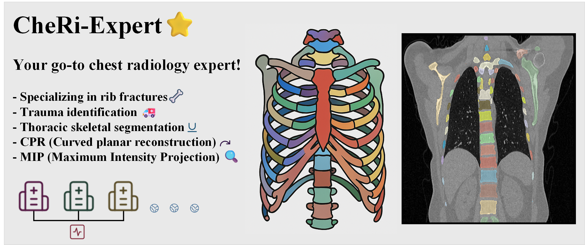

# CheRi-Expert 🌟

Your go-to chest radiology expert! 🩻 Specializing in rib fractures 🦴, trauma identification 🚑, thoracic skeletal segmentation 🧩, CPR (Curved planar reconstruction) ❤️‍🩹, and MIP (Maximum Intensity Projection) tools 🔍.

We are working diligently on the project construction... 🚧✨
